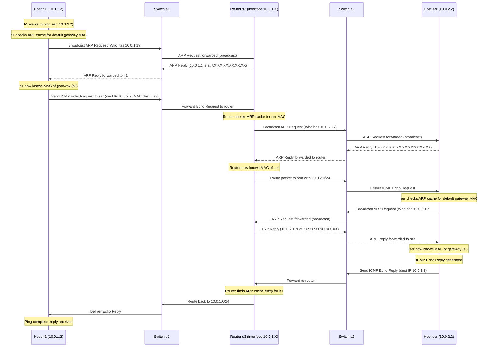

# Lab1 Notes

## First test with the ryu 'simple_switch' app and single switch topology

Start the Ryu controller with the `simple_switch` application. This application is a basic switch that forwards packets based on MAC addresses.

```bash
ryu-manager ryu.app.simple_switch
```

Start the Mininet single switch topology with three hosts and with the `--controller` option to specify the Ryu controller.

```bash
sudo mn --topo single,3 --mac --controller remote --switch ovsk --test pingall
```

Don't forget to clean up the Mininet environment after testing.

```bash
sudo mn -c
```

## Second test with the ryu 'simple_switch' app and custom topology

Network topology and configuration for this lab.


Launch the python script with the custom topology, expecting a remote controller.

```bash
sudo python3 run_network.py
```

Again, use the ryu controller with the `simple_switch` application and test it with the pingall command.

```bash
mininet> pingall
*** Ping: testing ping reachability
ext -> X X X
h1 -> X h2 ser
h2 -> X h1 ser
ser -> X h1 h2
*** Results: 50% dropped (6/12 received)
```

This indicates a successful topology setup. Additionally to the pingall command, you can also use the `iperf` command to test bandwidth between hosts.

```bash
mininet> iperf h1 h2
*** Iperf: testing TCP bandwidth between h1 and h2
*** Results: ['12.1 Mbits/sec', '14.8 Mbits/sec']
```

Finally, every host should be able to ping its own gateway, but not the gateways of others.

```bash
mininet> h1 ping 10.0.1.1 -c1
PING 10.0.1.1 (10.0.1.1) 56(84) bytes of data.
From 10.0.1.2 icmp_seq=1 Destination Host Unreachable

--- 10.0.1.1 ping statistics ---
1 packets transmitted, 0 received, +1 errors, 100% packet loss, time 0ms
```

It seems that this is not working with the `simple_swithch` application.

Check the fowarding table entries.

```bash
 sudo ovs-ofctl dump-flows s1
 cookie=0x0, duration=102.800s, table=0, n_packets=3, n_bytes=238, in_port="s1-eth2",dl_src=26:dc:3b:41:cd:a0,dl_dst=e6:15:16:c0:ec:90 actions=output:"s1-eth1"
 cookie=0x0, duration=102.771s, table=0, n_packets=2, n_bytes=140, in_port="s1-eth1",dl_src=e6:15:16:c0:ec:90,dl_dst=26:dc:3b:41:cd:a0 actions=output:"s1-eth2"
 cookie=0x0, duration=102.612s, table=0, n_packets=3, n_bytes=238, in_port="s1-eth3",dl_src=52:da:c1:61:8a:86,dl_dst=e6:15:16:c0:ec:90 actions=output:"s1-eth1"
 cookie=0x0, duration=102.590s, table=0, n_packets=2, n_bytes=140, in_port="s1-eth1",dl_src=e6:15:16:c0:ec:90,dl_dst=52:da:c1:61:8a:86 actions=output:"s1-eth3"
 cookie=0x0, duration=102.296s, table=0, n_packets=3, n_bytes=238, in_port="s1-eth3",dl_src=52:da:c1:61:8a:86,dl_dst=26:dc:3b:41:cd:a0 actions=output:"s1-eth2"
 cookie=0x0, duration=102.275s, table=0, n_packets=2, n_bytes=140, in_port="s1-eth2",dl_src=26:dc:3b:41:cd:a0,dl_dst=52:da:c1:61:8a:86 actions=output:"s1-eth3"
```

Explanation of the output:

- `cookie=0x0`: An identifier used by the controller to track flows (not typically important for simple switches).

- `duration=102.800s`: How long this flow has been in the switch's table.

- `table=0`: Refers to OpenFlow table 0 (the default).

- `n_packets=3`: Number of packets matched by this flow so far.

- `n_bytes=238`: Total bytes matched.

- `in_port="s1-eth2"`: The incoming interface.

- `dl_src=26:dc:3b:41:cd:a0`: Source MAC address.

- `dl_dst=e6:15:16:c0:ec:90`: Destination MAC address.

- `actions=output:"s1-eth1"`: Packets matching this flow should be forwarded out s1-eth1.

s1:

| **Cookie** | **Duration (s)** | **Table** | **Packets** | **Bytes** | **In Port**  | **Source MAC**           | **Destination MAC**      | **Action (Output Port)** |
|------------|------------------|-----------|-------------|-----------|--------------|---------------------------|---------------------------|---------------------------|
| 0x0        | 102.800          | 0         | 3           | 238       | s1-eth2      | 26:dc:3b:41:cd:a0         | e6:15:16:c0:ec:90         | s1-eth1                   |
| 0x0        | 102.771          | 0         | 2           | 140       | s1-eth1      | e6:15:16:c0:ec:90         | 26:dc:3b:41:cd:a0         | s1-eth2                   |
| 0x0        | 102.612          | 0         | 3           | 238       | s1-eth3      | 52:da:c1:61:8a:86         | e6:15:16:c0:ec:90         | s1-eth1                   |
| 0x0        | 102.590          | 0         | 2           | 140       | s1-eth1      | e6:15:16:c0:ec:90         | 52:da:c1:61:8a:86         | s1-eth3                   |
| 0x0        | 102.296          | 0         | 3           | 238       | s1-eth3      | 52:da:c1:61:8a:86         | 26:dc:3b:41:cd:a0         | s1-eth2                   |
| 0x0        | 102.275          | 0         | 2           | 140       | s1-eth2      | 26:dc:3b:41:cd:a0         | 52:da:c1:61:8a:86         | s1-eth3                   |

s2:

| **Cookie** | **Duration (s)** | **Table** | **Packets** | **Bytes** | **In Port**  | **Source MAC**           | **Destination MAC**      | **Action (Output Port)** |
|------------|------------------|-----------|-------------|-----------|--------------|---------------------------|---------------------------|---------------------------|
| 0x0        | 1431.181         | 0         | 3           | 238       | s2-eth1      | 8a:f1:d9:63:d5:8e         | 0e:20:33:fc:8f:3b         | s2-eth2                   |
| 0x0        | 1431.052         | 0         | 2           | 140       | s2-eth2      | 0e:20:33:fc:8f:3b         | 8a:f1:d9:63:d5:8e         | s2-eth1                   |
| 0x0        | 1430.838         | 0         | 3           | 238       | s2-eth1      | 8a:f1:d9:63:d5:8e         | e6:37:ec:5a:d6:61         | s2-eth2                   |
| 0x0        | 1430.724         | 0         | 2           | 140       | s2-eth2      | e6:37:ec:5a:d6:61         | 8a:f1:d9:63:d5:8e         | s2-eth1                   |

s3:

| **Cookie** | **Duration (s)** | **Table** | **Packets** | **Bytes** | **In Port**  | **Source MAC**           | **Destination MAC**      | **Action (Output Port)** |
|------------|------------------|-----------|-------------|-----------|--------------|---------------------------|---------------------------|---------------------------|
| 0x0        | 1487.098         | 0         | 3           | 238       | s3-eth3      | 8a:f1:d9:63:d5:8e         | 0e:20:33:fc:8f:3b         | s3-eth2                   |
| 0x0        | 1487.022         | 0         | 2           | 140       | s3-eth2      | 0e:20:33:fc:8f:3b         | 8a:f1:d9:63:d5:8e         | s3-eth3                   |
| 0x0        | 1486.764         | 0         | 3           | 238       | s3-eth3      | 8a:f1:d9:63:d5:8e         | e6:37:ec:5a:d6:61         | s3-eth2                   |
| 0x0        | 1486.694         | 0         | 2           | 140       | s3-eth2      | e6:37:ec:5a:d6:61         | 8a:f1:d9:63:d5:8e         | s3-eth3                   |

## Task 1: Everyone Is Learning, Including Switches

Start the custom controller first.

```bash
ryu-manager ans_controller.py
```

Run mininet with the topology defined in the python script.

```bash
sudo python3 run_network.py
```

Test the network by pinging `h2` from `h1`.

```bash
mininet> h1 ping -c1 h2
PING 10.0.1.3 (10.0.1.3) 56(84) bytes of data.
64 bytes from 10.0.1.3: icmp_seq=1 ttl=64 time=42.9 ms

--- 10.0.1.3 ping statistics ---
1 packets transmitted, 1 received, 0% packet loss, time 0ms
rtt min/avg/max/mdev = 42.925/42.925/42.925/0.000 ms
```

Then try to ping other connections with the `pingall` command.

```bash
mininet> pingall
*** Ping: testing ping reachability
ext -> X X X
h1 -> X h2 X
h2 -> X h1 X
ser -> X X X
*** Results: 83% dropped (2/12 received)
```

As expected, the ping between `h1` and `h2` works, but the ping to the external network does not work. Also iperf between `h1` and `h2` doesn't work yet.

See what the switch `s1` has learned:

```bash
vagrant@ans-vm:/vagrant/lab1$ sudo ovs-ofctl dump-flows s1
  cookie=0x0, duration=874.499s, table=0, n_packets=2247, n_bytes=148310, priority=1,in_port="s1-eth2",dl_dst=fa:b2:cd:84:28:f0 actions=output:"s1-eth1"
  cookie=0x0, duration=874.477s, table=0, n_packets=2328, n_bytes=6707224, priority=1,in_port="s1-eth1",dl_dst=4a:24:67:15:93:45 actions=output:"s1-eth2"
  cookie=0x0, duration=876.864s, table=0, n_packets=74, n_bytes=5592, priority=0 actions=CONTROLLER:65535
```

Formatted output:

| **Cookie** | **Duration (s)** | **Table** | **Packets** | **Bytes** | **In Port**  | **Destination MAC**      | **Action (Output Port)** | **Priority** |
|------------|------------------|-----------|-------------|-----------|--------------|---------------------------|---------------------------|--------------|
| 0x0        | 874.499          | 0         | 2247        | 148310    | s1-eth2      | fa:b2:cd:84:28:f0         | s1-eth1                   | 1            |
| 0x0        | 874.477          | 0         | 2328        | 6707224   | s1-eth1      | 4a:24:67:15:93:45         | s1-eth2                   | 1            |
| 0x0        | 876.864          | 0         | 74          | 5592      |              |                           | CONTROLLER:65535          | 0            |

## Task 2: Routers Are Busy

The controller knows the following mapping of the router:

```python
# Router port MACs assumed by the controller
port_to_own_mac = {
1: "00:00:00:00:01:01",
2: "00:00:00:00:01:02",
3: "00:00:00:00:01:03"
}
# Router port (gateways) IP addresses assumed by the controller
port_to_own_ip = {
1: "10.0.1.1",
2: "10.0.2.1",
3: "192.168.1.1"
}
```

Task:
    - The router must route all traffic between the subnets (identified by their unique IP prefixes).
    - The router must learn the routes.
    - All hosts should be able to ping each other, except host ext which should not be able to ping any of the other (internal) hosts
    - All hosts should be able to reach each other with TCP/UDP connections, except that such connections between ext and ser are not allowed due to security reasons

The controller must do the following to enable the router functionality:

Strategy:

This happens when a host (e.g. `h1`) sends a packet to a host in a different subnet (e.g. `ser`) for the first time without knowing the MAC address of the destination host:



>Idea: Also include `h2` which does not respond to the ARP request.

The actual SDN flow including a controller assuming the controller knows the MAC and IP addresses of the router ports:

```mermaid
sequenceDiagram
    participant h1 as Host h1 (10.0.1.2) <br> [MAC 00:00:00:00:01:AA]
    participant s1 as Switch s1
    participant s3 as Router s3 (10.0.1.1, 10.0.2.1) <br> [MAC 00:00:00:00:01:01, <br> 00:00:00:00:01:02]
    participant s2 as Switch s2
    participant ser as Host ser (10.0.2.2) <br> [MAC 00:00:00:00:02:CC]
    participant c1 as Controller c1

    Note over h1: h1 wants to ping 10.0.2.2
    Note over h1: h1 notices that IP belongs to different subnet
    Note over h1: h1 has no ARP cache entry for gateway

    %% --- ARP Phase ---
    h1->>s1: [ARP] ARP Request: "Who has 10.0.1.1?"
    s1->>c1: Packet-In: "What to do with dst MAC FF:FF:FF:FF:FF:FF?"
    Note over c1: Memorize MAC and Port of h1 at s1
    c1-->>s1: Packet-Out: "Flood broadcast MAC to all ports"
    s1->>s3: ARP Request: "Who has 10.0.1.1?"
    Note over s3: s3 / router is only modeled as a switch,<br>it treats the packet like a switch
    s3->>c1: Packet-In: "What to do with dst MAC FF:FF:FF:FF:FF:FF?"
    Note over c1: Notice that router functionality is needed
    Note over c1: Got packet of ETH_TYPE_ARP
    Note over c1: Prepare ARP reply with own MAC and IP of s3
    Note over c1: Use input port for ARP reply
    c1-->>s3: Packet-Out: "Send ARP reply to port 1"
    s3->>s1: ARP Reply: "10.0.1.1 is at 00:00:00:00:01:01"
    s1->>c1: Packet-In: "What to do with dst MAC 00:00:00:00:01:AA?"
    Note over c1: Memorize MAC and Port of s3 at s1
    Note over c1: Recall that MAC of h1 was seen on port 1
    c1-->>s1: FlowMod: "Forward known MAC 00:00:00:00:01:AA to port 1"
    Note over s1: s1 now knows s3->h1 mapping
    c1-->>s1: Packet-Out: "Forward ARP reply to port 1"
    s1->>h1: ARP Reply: "10.0.1.1 is at 00:00:00:00:01:01"
    Note over h1: h1 now knows MAC of gateway (s3)

    %% --- ICMP Echo Request Phase ---
    Note over h1: Proceed with ICMP Echo Request
    h1->>s1: [IP] ICMP Echo Request to 10.0.2.2
    s1->>c1: Packet-In: "What to do with dst MAC 00:00:00:00:01:01?"
    Note over c1: Recall that MAC of s3 was seen on port 2
    c1-->>s1: FlowMod: "Forward MAC 00:00:00:00:01:01 to port 3"
    Note over s1: s1 now knows h1->s3 mapping
    s1->>s3: Forward ICMP request to s3
    Note over s3: s3 / router is only modeled as a switch,<br>it treats the packet like a switch
    s3->>c1: Packet-In: "What to do with dst MAC 00:00:00:00:01:01?"
    %% --- ARP for getting the MAC of ser Phase ---
    Note over c1: Notice that router functionality is needed
    Note over c1: Got packet of ETH_TYPE_IP
    Note over c1: New host MAC and IP address seen,<br>add an entry to the ARP table
    Note over c1: Parse network address and notice that<br>dst IP is in different subnet
    Note over c1: c1 (router) has no ARP cache entry for ser
    Note over c1: Look up IP-to-Port mapping
    Note over c1: Prepare ARP request for MAC of ser<br>and send on looked up port
    c1-->>s3: Packet-Out: "Send ARP request for 10.0.2.2 on port 2"
    s3->>s2: ARP Request: "Who has 10.0.2.2?"
    s2->>c1: Packet-In: "What to do with dst MAC FF:FF:FF:FF:FF:FF?"
    Note over c1: Memorize MAC and Port of s3 at s2
    c1-->>s2: Packet-Out: "Flood broadcast MAC to all ports"
    s2->>ser: ARP Request: "Who has 10.0.2.2?"
    ser->>s2: ARP Reply: "10.0.2.2 is at 00:00:00:00:02:CC"
    s2->>c1: Packet-In: "What to do with dst MAC 00:00:00:00:01:02?"
    Note over c1: Memorize MAC and Port of ser at s2
    Note over c1: Recall that MAC of s3 was seen on port 1
    %% Theoretically, the controller could just finish the ARP request here and drop the packet, because not the router wanted to know the MAC of ser, but the controller.
    c1-->>s2: FlowMod: "Forward MAC 00:00:00:00:01:02 to port 1"
    Note over s2: s2 now knows ser->s3 mapping
    c1-->>s2: Packet-Out: "Forward ARP reply to port 1"
    s2->>s3: ARP Reply: "10.0.2.2 is at 00:00:00:00:02:CC"
    Note over s3: s3 / router is only modeled as a switch,<br>it doesn't know that this is its own MAC address
    s3->>c1: Packet-In: "What to do with dst MAC 00:00:00:00:01:02?"
    Note over c1: s3 / c1 now knows MAC of ser and continues<br>with paused ICMP Echo request
    %% --- Resume ICMP Echo Request Phase ---
    Note over c1: Modify ICMP packet src and dst MAC
    c1-->>s3: Packet-Out: "Forward ICMP request to port 2"
    s3->>s2: Forward ICMP packet to s2
    s2->>c1: Packet-In: "What to do with dst MAC 00:00:00:00:02:CC?"
    Note over c1: Recall that MAC of ser was seen on port 2
    c1-->>s2: FlowMod: "Forward MAC 00:00:00:00:02:CC to port 2"
    Note over s2: s2 now knows s3->ser mapping
    c1-->>s2: Packet-Out: "Forward ICMP request to port 2"
    s2->>ser: Deliver ICMP Echo Request

    %% --- ICMP Echo Reply Phase (ser replies) ---
    Note over ser: ser notices that IP belongs to different subnet
    Note over ser: ser has no ARP cache entry for gateway
    %% --- ARP for getting the MAC of s3 Phase ---
    ser->>s2: ARP Request: "Who has 10.0.2.1?"
    s2->>c1: Packet-In: "What to do with dst MAC FF:FF:FF:FF:FF:FF?"
    c1-->>s2: Packet-Out: "Flood broadcast MAC to all ports"
    s2->>s3: ARP Request: "Who has 10.0.2.1?"
    s3->>c1: Packet-In: "What to do with ARP request?"
    Note over c1: Notice that router functionality is needed
    Note over c1: Got packet of ETH_TYPE_ARP
    Note over c1: Prepare ARP reply with own MAC and IP of s3
    Note over c1: Use input port for ARP reply
    c1-->>s3: Packet-Out: "Send ARP reply to port 2"
    s3->>s2: ARP Reply: "10.0.2.1 is at 00:00:00:00:01:02"
    Note over s2: Use installed flow for s3->ser
    s2->>ser: ARP Reply: "10.0.2.1 is at 00:00:00:00:01:02"
    Note over ser: ser now knows MAC of gateway (s3)
    %% --- Resume ICMP Echo Reply Phase ---
    Note over ser: Proceed with ICMP Echo Reply
    ser->>s2: ICMP Echo Reply to IP 10.0.1.2
    Note over s2: Use installed flow for ser->s3
    s2->>s3: Forward ICMP reply to s3
    Note over s3: s3 / router is only modeled as a switch,<br>it treats the packet like a switch
    s3->>c1: Packet-In: "What to do with dst MAC 00:00:00:00:01:02?"
    Note over c1: Notice that router functionality is needed
    Note over c1: Got packet of ETH_TYPE_IP
    Note over c1: New host MAC and IP address seen,<br>add an entry to the ARP table
    Note over c1: Parse network address and notice that<br>dst IP is in different subnet
    Note over c1: c1 (router) finds ARP cache entry for h1
    Note over c1: Look up IP-to-Port mapping
    Note over c1: Modify ICMP packet src and dst MAC
    c1-->>s3: Packet-Out: "Forward ICMP reply to port 1"
    s3->>s1: Forward ICMP reply to s1
    Note over s1: Use installed flow for s3->h1
    s1->>h1: Deliver ICMP Echo Reply

    Note over h1: Ping complete
```



Tasks:
    - Router must only respond to ethernet packets with the MAC address of the router or the broadcast MAC address.
    - Router must respond to ARP requests with the MAC address of the router.

Questions:
    - Does the controller need to manage an ARP table for the router? See [here](https://github.com/knetsolutions/learn-sdn-with-ryu/blob/master/ryu_part9.md)
