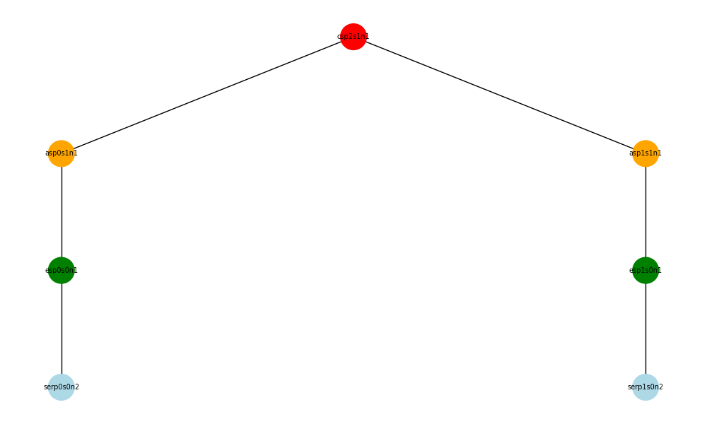
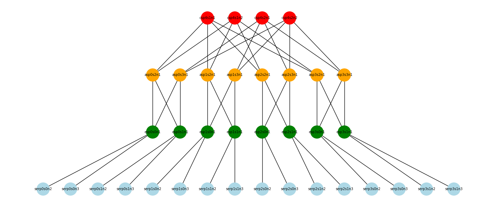
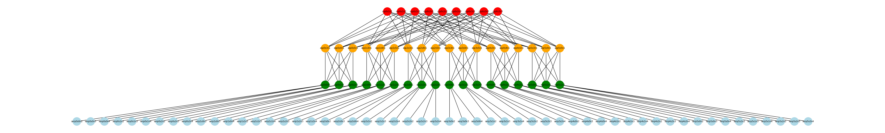

# Lab2 Notes

## Used Commands

### Starting the Ryu Controller

```bash
clear; ryu-manager ./sp_routing.py --observe-links
```

```bash
clear; ryu-manager ./ft_routing.py --observe-links
```

### Starting Mininet

```bash
clear; ./run.sh
```

### Dump Flows

```bash	
sudo ovs-ofctl dump-flows switch1
```

## Topology Discovery

Switches in the network will be discovered when they register with the controller. The controller will receive a `SwitchEnter` event for each switch that connects to it. The connected switches can be retireved using the `get_switch` method of the controller. Logging the returned switches will show their DPID (Datapath ID).

```
Switch<dpid=167903745, Port<dpid=167903745, port_no=4, LIVE> Port<dpid=167903745, port_no=1, LIVE> Port<dpid=167903745, port_no=2, LIVE> Port<dpid=167903745, port_no=3, LIVE> >
[...]
Switch<dpid=167772673, Port<dpid=167772673, port_no=4, LIVE> Port<dpid=167772673, port_no=1, LIVE> Port<dpid=167772673, port_no=2, LIVE> Port<dpid=167772673, port_no=3, LIVE> >
```

Links connecting the switches can be discovered using the `get_link` method of the controller. This will return a list of links, each represented by a `Link` object containing the source and destination switches and ports.

```
Link: Port<dpid=167838465, port_no=3, LIVE> to Port<dpid=168034818, port_no=4, LIVE>
Link: Port<dpid=168034818, port_no=3, LIVE> to Port<dpid=167969537, port_no=3, LIVE>
[...]
Link: Port<dpid=167904001, port_no=3, LIVE> to Port<dpid=167903489, port_no=2, LIVE>
Link: Port<dpid=167903745, port_no=4, LIVE> to Port<dpid=167903489, port_no=4, LIVE>
```

## SP Routing Tables

### Core Level

Upper left switch:

```bash
sudo ovs-ofctl dump-flows switch0
[sudo] password for tobilgs: 
 cookie=0x0, duration=66.392s, table=0, n_packets=68, n_bytes=4080, priority=65535,dl_dst=01:80:c2:00:00:0e,dl_type=0x88cc actions=CONTROLLER:65535
 cookie=0x0, duration=61.242s, table=0, n_packets=23, n_bytes=2254, priority=1,ip,nw_dst=10.1.0.2 actions=output:"switch0-eth2"
 cookie=0x0, duration=61.163s, table=0, n_packets=23, n_bytes=2254, priority=1,ip,nw_dst=10.0.0.2 actions=output:"switch0-eth3"
 cookie=0x0, duration=61.104s, table=0, n_packets=23, n_bytes=2254, priority=1,ip,nw_dst=10.1.0.3 actions=output:"switch0-eth2"
 cookie=0x0, duration=60.977s, table=0, n_packets=23, n_bytes=2254, priority=1,ip,nw_dst=10.1.1.2 actions=output:"switch0-eth2"
 cookie=0x0, duration=60.837s, table=0, n_packets=23, n_bytes=2254, priority=1,ip,nw_dst=10.1.1.3 actions=output:"switch0-eth2"
 cookie=0x0, duration=60.714s, table=0, n_packets=23, n_bytes=2254, priority=1,ip,nw_dst=10.2.0.2 actions=output:"switch0-eth4"
 cookie=0x0, duration=60.587s, table=0, n_packets=23, n_bytes=2254, priority=1,ip,nw_dst=10.2.0.3 actions=output:"switch0-eth4"
 cookie=0x0, duration=60.474s, table=0, n_packets=23, n_bytes=2254, priority=1,ip,nw_dst=10.2.1.2 actions=output:"switch0-eth4"
 cookie=0x0, duration=60.352s, table=0, n_packets=23, n_bytes=2254, priority=1,ip,nw_dst=10.2.1.3 actions=output:"switch0-eth4"
 cookie=0x0, duration=60.238s, table=0, n_packets=23, n_bytes=2254, priority=1,ip,nw_dst=10.3.0.2 actions=output:"switch0-eth1"
 cookie=0x0, duration=60.115s, table=0, n_packets=23, n_bytes=2254, priority=1,ip,nw_dst=10.3.0.3 actions=output:"switch0-eth1"
 cookie=0x0, duration=59.980s, table=0, n_packets=23, n_bytes=2254, priority=1,ip,nw_dst=10.3.1.2 actions=output:"switch0-eth1"
 cookie=0x0, duration=59.857s, table=0, n_packets=23, n_bytes=2254, priority=1,ip,nw_dst=10.3.1.3 actions=output:"switch0-eth1"
 cookie=0x0, duration=59.536s, table=0, n_packets=23, n_bytes=2254, priority=1,ip,nw_dst=10.0.0.3 actions=output:"switch0-eth3"
 cookie=0x0, duration=58.358s, table=0, n_packets=23, n_bytes=2254, priority=1,ip,nw_dst=10.0.1.2 actions=output:"switch0-eth3"
 cookie=0x0, duration=57.184s, table=0, n_packets=23, n_bytes=2254, priority=1,ip,nw_dst=10.0.1.3 actions=output:"switch0-eth3"
 cookie=0x0, duration=66.442s, table=0, n_packets=34, n_bytes=2868, priority=0 actions=CONTROLLER:65535
```

### Aggregation Level

Middle left switch:

```bash
sudo ovs-ofctl dump-flows switch4
 cookie=0x0, duration=147.905s, table=0, n_packets=143, n_bytes=8580, priority=65535,dl_dst=01:80:c2:00:00:0e,dl_type=0x88cc actions=CONTROLLER:65535
 cookie=0x0, duration=142.950s, table=0, n_packets=27, n_bytes=2646, priority=1,ip,nw_dst=10.0.1.2 actions=output:"switch4-eth2"
 cookie=0x0, duration=142.894s, table=0, n_packets=27, n_bytes=2646, priority=1,ip,nw_dst=10.0.0.2 actions=output:"switch4-eth4"
 cookie=0x0, duration=142.856s, table=0, n_packets=27, n_bytes=2646, priority=1,ip,nw_dst=10.0.1.3 actions=output:"switch4-eth2"
 cookie=0x0, duration=142.769s, table=0, n_packets=7, n_bytes=686, priority=1,ip,nw_dst=10.1.0.2 actions=output:"switch4-eth3"
 cookie=0x0, duration=142.634s, table=0, n_packets=7, n_bytes=686, priority=1,ip,nw_dst=10.1.0.3 actions=output:"switch4-eth3"
 cookie=0x0, duration=142.507s, table=0, n_packets=7, n_bytes=686, priority=1,ip,nw_dst=10.1.1.2 actions=output:"switch4-eth3"
 cookie=0x0, duration=142.364s, table=0, n_packets=7, n_bytes=686, priority=1,ip,nw_dst=10.1.1.3 actions=output:"switch4-eth3"
 cookie=0x0, duration=142.245s, table=0, n_packets=7, n_bytes=686, priority=1,ip,nw_dst=10.2.0.2 actions=output:"switch4-eth3"
 cookie=0x0, duration=142.115s, table=0, n_packets=7, n_bytes=686, priority=1,ip,nw_dst=10.2.0.3 actions=output:"switch4-eth3"
 cookie=0x0, duration=141.999s, table=0, n_packets=7, n_bytes=686, priority=1,ip,nw_dst=10.2.1.2 actions=output:"switch4-eth3"
 cookie=0x0, duration=141.880s, table=0, n_packets=7, n_bytes=686, priority=1,ip,nw_dst=10.2.1.3 actions=output:"switch4-eth3"
 cookie=0x0, duration=141.767s, table=0, n_packets=7, n_bytes=686, priority=1,ip,nw_dst=10.3.0.2 actions=output:"switch4-eth3"
 cookie=0x0, duration=141.643s, table=0, n_packets=7, n_bytes=686, priority=1,ip,nw_dst=10.3.0.3 actions=output:"switch4-eth3"
 cookie=0x0, duration=141.508s, table=0, n_packets=7, n_bytes=686, priority=1,ip,nw_dst=10.3.1.2 actions=output:"switch4-eth3"
 cookie=0x0, duration=141.387s, table=0, n_packets=7, n_bytes=686, priority=1,ip,nw_dst=10.3.1.3 actions=output:"switch4-eth3"
 cookie=0x0, duration=141.196s, table=0, n_packets=27, n_bytes=2646, priority=1,ip,nw_dst=10.0.0.3 actions=output:"switch4-eth4"
 cookie=0x0, duration=147.957s, table=0, n_packets=37, n_bytes=3028, priority=0 actions=CONTROLLER:65535
```

### Edge Level

Bottom left switch:

```bash
sudo ovs-ofctl dump-flows switch6
 cookie=0x0, duration=217.327s, table=0, n_packets=104, n_bytes=6240, priority=65535,dl_dst=01:80:c2:00:00:0e,dl_type=0x88cc actions=CONTROLLER:65535
 cookie=0x0, duration=212.437s, table=0, n_packets=29, n_bytes=2842, priority=1,ip,nw_dst=10.0.0.3 actions=mod_dl_dst:00:00:00:00:00:02,mod_dl_src:00:00:0a:00:00:01,output:"switch6-eth1"
 cookie=0x0, duration=212.421s, table=0, n_packets=29, n_bytes=2842, priority=1,ip,nw_dst=10.0.0.2 actions=mod_dl_dst:00:00:00:00:00:01,mod_dl_src:00:00:0a:00:00:01,output:"switch6-eth3"
 cookie=0x0, duration=212.379s, table=0, n_packets=3, n_bytes=294, priority=1,ip,nw_dst=10.0.1.2 actions=output:"switch6-eth4"
 cookie=0x0, duration=212.285s, table=0, n_packets=3, n_bytes=294, priority=1,ip,nw_dst=10.0.1.3 actions=output:"switch6-eth4"
 cookie=0x0, duration=212.200s, table=0, n_packets=3, n_bytes=294, priority=1,ip,nw_dst=10.1.0.2 actions=output:"switch6-eth4"
 cookie=0x0, duration=212.061s, table=0, n_packets=3, n_bytes=294, priority=1,ip,nw_dst=10.1.0.3 actions=output:"switch6-eth4"
 cookie=0x0, duration=211.936s, table=0, n_packets=3, n_bytes=294, priority=1,ip,nw_dst=10.1.1.2 actions=output:"switch6-eth4"
 cookie=0x0, duration=211.797s, table=0, n_packets=3, n_bytes=294, priority=1,ip,nw_dst=10.1.1.3 actions=output:"switch6-eth4"
 cookie=0x0, duration=211.676s, table=0, n_packets=3, n_bytes=294, priority=1,ip,nw_dst=10.2.0.2 actions=output:"switch6-eth4"
 cookie=0x0, duration=211.543s, table=0, n_packets=3, n_bytes=294, priority=1,ip,nw_dst=10.2.0.3 actions=output:"switch6-eth4"
 cookie=0x0, duration=211.427s, table=0, n_packets=3, n_bytes=294, priority=1,ip,nw_dst=10.2.1.2 actions=output:"switch6-eth4"
 cookie=0x0, duration=211.309s, table=0, n_packets=3, n_bytes=294, priority=1,ip,nw_dst=10.2.1.3 actions=output:"switch6-eth4"
 cookie=0x0, duration=211.196s, table=0, n_packets=3, n_bytes=294, priority=1,ip,nw_dst=10.3.0.2 actions=output:"switch6-eth4"
 cookie=0x0, duration=211.071s, table=0, n_packets=3, n_bytes=294, priority=1,ip,nw_dst=10.3.0.3 actions=output:"switch6-eth4"
 cookie=0x0, duration=210.937s, table=0, n_packets=3, n_bytes=294, priority=1,ip,nw_dst=10.3.1.2 actions=output:"switch6-eth4"
 cookie=0x0, duration=210.820s, table=0, n_packets=3, n_bytes=294, priority=1,ip,nw_dst=10.3.1.3 actions=output:"switch6-eth4"
 cookie=0x0, duration=217.376s, table=0, n_packets=48, n_bytes=3720, priority=0 actions=CONTROLLER:65535
```

## FT Routing Tables

### Core Level

Upper left switch:

```bash
sudo ovs-ofctl dump-flows switch0
 cookie=0x0, duration=61.085s, table=0, n_packets=61, n_bytes=3660, priority=65535,dl_dst=01:80:c2:00:00:0e,dl_type=0x88cc actions=CONTROLLER:65535
 cookie=0x0, duration=61.036s, table=0, n_packets=24, n_bytes=2352, priority=1,ip,nw_dst=10.0.0.0/16 actions=output:"switch0-eth2"
 cookie=0x0, duration=61.036s, table=0, n_packets=24, n_bytes=2352, priority=1,ip,nw_dst=10.1.0.0/16 actions=output:"switch0-eth4"
 cookie=0x0, duration=61.036s, table=0, n_packets=24, n_bytes=2352, priority=1,ip,nw_dst=10.2.0.0/16 actions=output:"switch0-eth1"
 cookie=0x0, duration=61.036s, table=0, n_packets=24, n_bytes=2352, priority=1,ip,nw_dst=10.3.0.0/16 actions=output:"switch0-eth3"
 cookie=0x0, duration=61.099s, table=0, n_packets=54, n_bytes=7242, priority=0 actions=CONTROLLER:65535
```

### Aggregation Level

Middle left switch:

```bash
sudo ovs-ofctl dump-flows switch4
 cookie=0x0, duration=118.377s, table=0, n_packets=116, n_bytes=6960, priority=65535,dl_dst=01:80:c2:00:00:0e,dl_type=0x88cc actions=CONTROLLER:65535
 cookie=0x0, duration=118.326s, table=0, n_packets=28, n_bytes=2744, priority=10,ip,nw_dst=10.0.0.0/24 actions=output:"switch4-eth1"
 cookie=0x0, duration=118.326s, table=0, n_packets=28, n_bytes=2744, priority=10,ip,nw_dst=10.0.1.0/24 actions=output:"switch4-eth4"
 cookie=0x0, duration=118.326s, table=0, n_packets=24, n_bytes=2352, priority=1,ip,nw_dst=0.0.0.2/0.0.0.255 actions=output:"switch4-eth2"
 cookie=0x0, duration=118.326s, table=0, n_packets=24, n_bytes=2352, priority=1,ip,nw_dst=0.0.0.3/0.0.0.255 actions=output:"switch4-eth3"
 cookie=0x0, duration=118.388s, table=0, n_packets=56, n_bytes=7402, priority=0 actions=CONTROLLER:65535
```

### Edge Level

Bottom left switch:

```bash
sudo ovs-ofctl dump-flows switch6
 cookie=0x0, duration=29.664s, table=0, n_packets=16, n_bytes=960, priority=65535,dl_dst=01:80:c2:00:00:0e,dl_type=0x88cc actions=CONTROLLER:65535
 cookie=0x0, duration=26.672s, table=0, n_packets=29, n_bytes=2842, priority=10,ip,nw_dst=10.0.0.3 actions=mod_dl_dst:00:00:00:00:00:02,mod_dl_src:00:00:0a:00:00:01,output:"switch6-eth3"
 cookie=0x0, duration=26.659s, table=0, n_packets=29, n_bytes=2842, priority=10,ip,nw_dst=10.0.0.2 actions=mod_dl_dst:00:00:00:00:00:01,mod_dl_src:00:00:0a:00:00:01,output:"switch6-eth1"
 cookie=0x0, duration=29.627s, table=0, n_packets=2, n_bytes=196, priority=9,ip,nw_dst=10.0.0.0/24 actions=CONTROLLER:65535
 cookie=0x0, duration=29.627s, table=0, n_packets=28, n_bytes=2744, priority=1,ip,nw_dst=0.0.0.2/0.0.0.255 actions=output:"switch6-eth2"
 cookie=0x0, duration=29.627s, table=0, n_packets=28, n_bytes=2744, priority=1,ip,nw_dst=0.0.0.3/0.0.0.255 actions=output:"switch6-eth4"
 cookie=0x0, duration=29.672s, table=0, n_packets=43, n_bytes=4766, priority=0 actions=CONTROLLER:65535
```

## Testing and Comparing Routing Protocols

| Routing | Client   | Server   | Protocol | Transfer [MBytes] | Bandwidth [Mbits/s] |
|---------|----------|----------|----------|-------------------|---------------------|
| SP      | 10.0.0.2 | 10.2.1.2 | TCP      | 24.6              | 8.97                |
| FT      | 10.0.0.2 | 10.2.1.2 | TCP      | 40.2              | 16.7                |
| SP      | 10.0.0.3 | 10.2.1.3 | TCP      | 20.8              | 7.79                |
| FT      | 10.0.0.3 | 10.2.1.3 | TCP      | 43.8              | 16.3                |

| Routing | Client   | Server   | Protocol | Transfer [MBytes] | Bandwidth [Mbits/s] | Jitter [ms] | Lost/Total [%] |
|---------|----------|----------|----------|-------------------|---------------------|-------------|----------------|
| SP      | 10.0.0.2 | 10.2.1.2 | UDP      | 37.5              | 15                  | 1.384       | 54             |
| SP      | 10.0.0.3 | 10.2.1.3 | UDP      | 37.5              | 15                  | 1.092       | 53             |
| FT      | 10.0.0.2 | 10.2.1.2 | UDP      | 37.5              | 15                  | 0.698       | 13             |
| FT      | 10.0.0.3 | 10.2.1.3 | UDP      | 37.5              | 15                  | 1.173       | 13             |

### iperf Results

#### TCP Results


#### UDP Results


<!--  -->

<!--  -->

<!--  -->

<!--  -->

### 1. Topology

Expected number of:
Links = 3*(k**3)/4
Switches = 5*(k**2)/4 
Server/Host = k**3/4

| k   | Hosts (k³ / 4) | Switches (5·k² / 4) | Links (3·k³ / 4) |
|-----|----------------|---------------------|------------------|
| 2   | 2              | 5                   | 6                |
| 4   | 16             | 20                  | 48               |
| 6   | 54             | 45                  | 162              |
| 8   | 128            | 80                  | 384              |
| 10  | 250            | 125                 | 750              |







### 2. SP-Routing

Port-Discovery:
ARP-Handling:

### 3. FT-Routing

Port-Discovery:
ARP-Handling:

### 4. Routing-Experiments
(see above)

