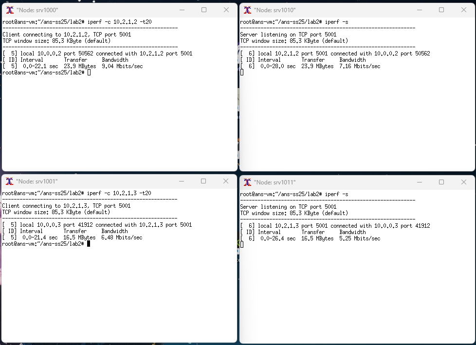
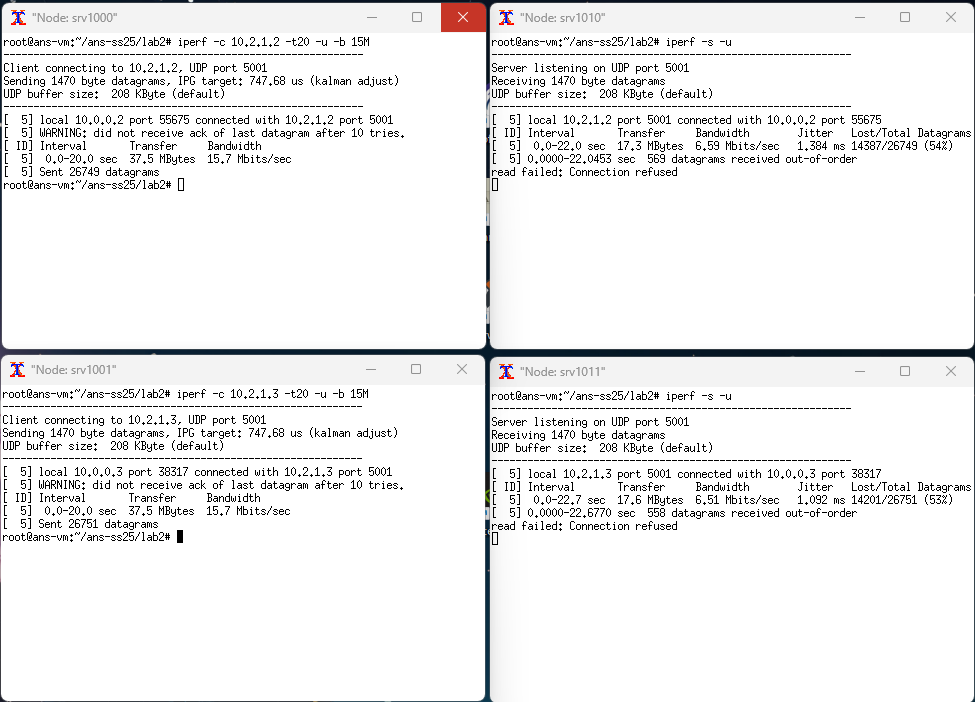
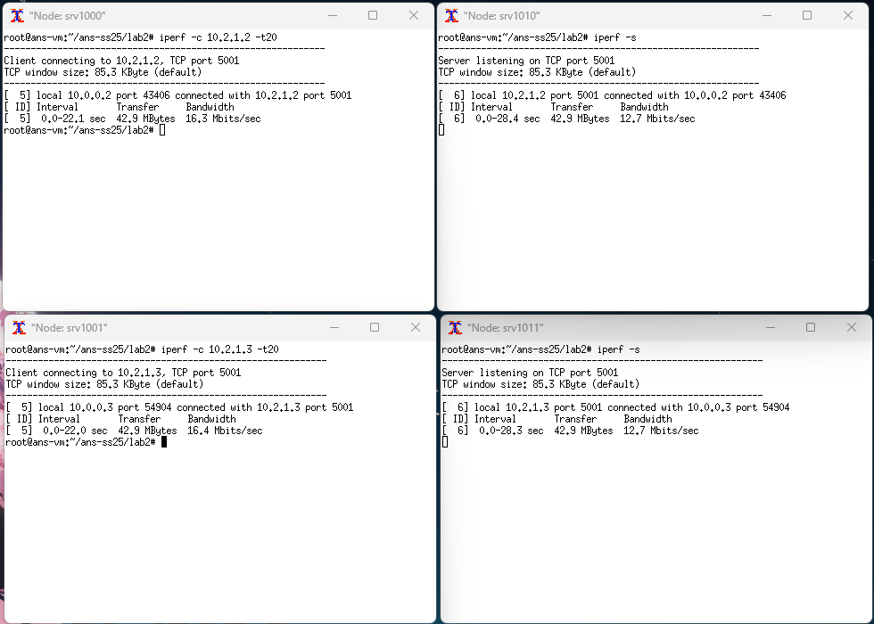
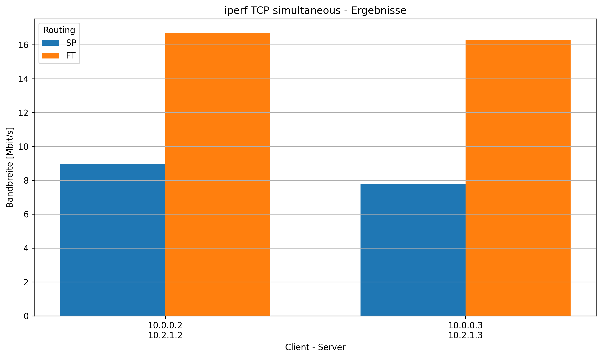
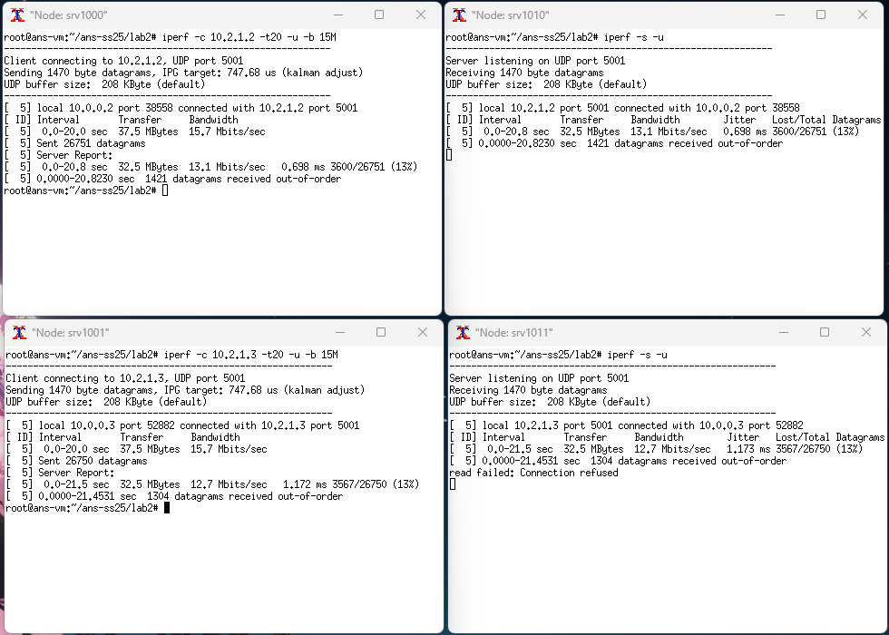
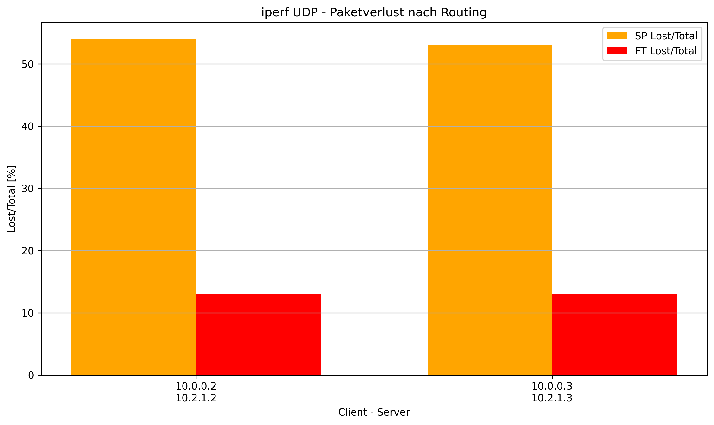

# Lab2 Notes

## Used Commands

### Starting the Ryu Controller

```bash
clear; ryu-manager ./sp_routing.py --observe-links
```

```bash
clear; ryu-manager ./ft_routing.py --observe-links
```

### Starting Mininet

```bash
clear; ./run.sh
```

### Dump Flows

```bash	
sudo ovs-ofctl dump-flows switch1
```

## Topology Discovery

Switches in the network will be discovered when they register with the controller. The controller will receive a `SwitchEnter` event for each switch that connects to it. The connected switches can be retireved using the `get_switch` method of the controller. Logging the returned switches will show their DPID (Datapath ID).

```
Switch<dpid=167903745, Port<dpid=167903745, port_no=4, LIVE> Port<dpid=167903745, port_no=1, LIVE> Port<dpid=167903745, port_no=2, LIVE> Port<dpid=167903745, port_no=3, LIVE> >
[...]
Switch<dpid=167772673, Port<dpid=167772673, port_no=4, LIVE> Port<dpid=167772673, port_no=1, LIVE> Port<dpid=167772673, port_no=2, LIVE> Port<dpid=167772673, port_no=3, LIVE> >
```

Links connecting the switches can be discovered using the `get_link` method of the controller. This will return a list of links, each represented by a `Link` object containing the source and destination switches and ports.

```
Link: Port<dpid=167838465, port_no=3, LIVE> to Port<dpid=168034818, port_no=4, LIVE>
Link: Port<dpid=168034818, port_no=3, LIVE> to Port<dpid=167969537, port_no=3, LIVE>
[...]
Link: Port<dpid=167904001, port_no=3, LIVE> to Port<dpid=167903489, port_no=2, LIVE>
Link: Port<dpid=167903745, port_no=4, LIVE> to Port<dpid=167903489, port_no=4, LIVE>
```

## SP Routing Tables

### Core Level

## Testing and Comparing Routing Protocols

| Routing | Client   | Server   | Protocol | Transfer [MBytes] | Bandwidth [Mbits/s] |
|---------|----------|----------|----------|-------------------|---------------------|
| SP      | 10.0.0.2 | 10.2.1.2 | TCP      | 24.6              | 8.97                |
| FT      | 10.0.0.2 | 10.2.1.2 | TCP      | 40.2              | 16.7                |
| SP      | 10.0.0.3 | 10.2.1.3 | TCP      | 20.8              | 7.79                |
| FT      | 10.0.0.3 | 10.2.1.3 | TCP      | 43.8              | 16.3                |

| Routing | Client   | Server   | Protocol | Transfer [MBytes] | Bandwidth [Mbits/s] | Jitter [ms] | Lost/Total [%] |
|---------|----------|----------|----------|-------------------|---------------------|-------------|----------------|
| SP      | 10.0.0.2 | 10.2.1.2 | UDP      | 37.5              | 15                  | 1.384       | 54             |
| SP      | 10.0.0.3 | 10.2.1.3 | UDP      | 37.5              | 15                  | 1.092       | 53             |
| FT      | 10.0.0.2 | 10.2.1.2 | UDP      | 37.5              | 15                  | 0.698       | 13             |
| FT      | 10.0.0.3 | 10.2.1.3 | UDP      | 37.5              | 15                  | 1.173       | 13             |

### SP-Routing iperf results

#### SP TCP Results



#### SP UDP Results



### FT-Routing iperf results

#### FT TCP Results





#### FT UDP Results


